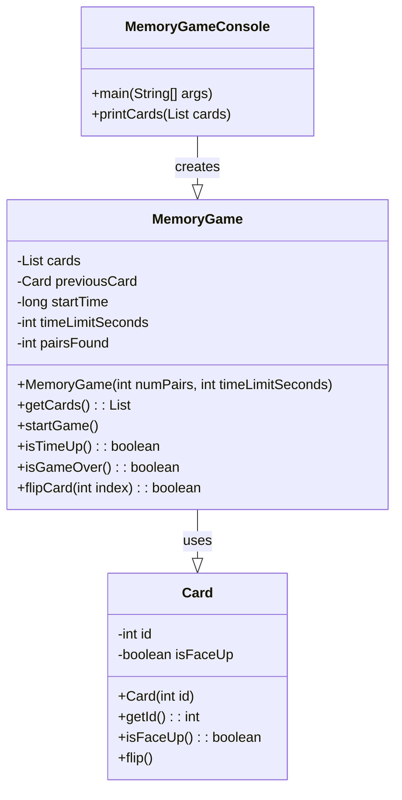

# 記憶力挑戰賽
###  遊戲目標 
該遊戲主要面向希望提高記憶力和專注力的玩家。遊戲的目標是在限定的時間內翻開並配對一組隱藏的卡片。
###  玩法
-  玩家輸入卡片配對數量和遊戲時間限制。
-  遊戲開始，卡片會隨機洗牌並以背面朝上的方式顯示。
-  玩家依次翻開兩張卡片，若兩張卡片相同，則配對成功；若不同，則兩張卡片重新翻回背面。
-  玩家需要在限定時間內完成所有卡片的配對。
-  用戶界面為基於控制台的文字界面，玩家需要通過輸入指令來與遊戲互動。
###  技術實現
本遊戲使用Java語言開發，並運行在Java SE環境中。
##  記憶翻牌遊戲結構

### 類別概念
- `Card`：單張卡片（ID、是否翻開／是否配對成功）。
- `MemoryGame`：遊戲中樞，管理**卡片列表、回合邏輯、時間限制**與玩家互動介面（方法）。

### `Card` 欄位與行為
| 成員         | 型別    | 說明                   |
|--------------|---------|------------------------|
| `id`         | `int`   | 卡片識別碼（配對依據） |
| `isFlipped`  | `bool`  | 是否翻面               |
| `isMatched`  | `bool`  | 是否已配對成功         |

**常見方法**
- `flip()`：翻面/蓋回
- `markMatched()`：標記為已配對
- `reset()`：重置

### `MemoryGame` 型別與成員
| 成員              | 型別           | 說明                                  |
|-------------------|----------------|---------------------------------------|
| `cards`           | `List<Card>`   | 全部卡片清單                          |
| `timeLimitSec`    | `int`          | 時間限制（秒）                        |
| `firstPickIndex`  | `int`         | 第一張選擇的索引                      |
| `moves`           | `int`          | 移動次數/翻牌次數                     |
| `matchedPairs`    | `int`          | 已配對成功的組數                      |
| `isGameOver`      | `bool`         | 是否結束（時間到或全配對）            |

**常見方法**
- `start()`：初始化並洗牌
- `pick(index)`：玩家選牌（處理**兩張比較**、更新分數/狀態）
- `tick(delta)`：倒數計時（更新 `isGameOver`）
- `reset()`：重新開始
- `allMatched()`：是否全部配對

---

###  類別圖

  

